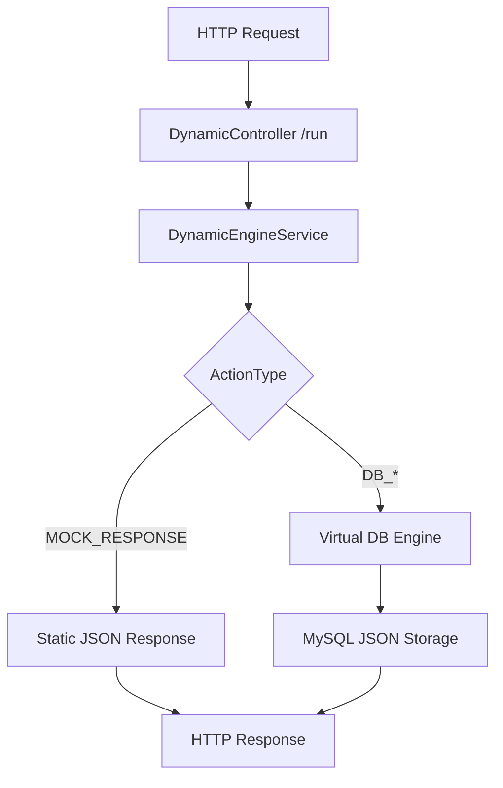

<p align="right">
  <a href="./README.md">🇬🇧 English</a>
</p>

# 🚀 Dynamic Backend Engine (MVP)


> **Dynamic Backend Engine** es un motor backend SaaS tipo **No-Code API Builder** que permite definir, desplegar y ejecutar **APIs RESTful dinámicas en tiempo de ejecución (runtime)** sin escribir código ni reiniciar el servidor.

---

## 🧠 Concepto Clave

> **La API no está en el código, está en la base de datos.**

Los usuarios configuran endpoints dinámicos (path, método y lógica) directamente en la BBDD, y el motor interpreta y ejecuta esa definición en tiempo real.

Ideal para:
- Prototipado rápido
- Plataformas No-Code / Low-Code
- Backends SaaS multi-tenant
- MVPs que evolucionan sin redeploys

---

## 🧱 Stack Tecnológico

- **Framework:** NestJS (TypeScript)
- **Base de Datos:** MySQL 8.0
- **ORM:** Sequelize + Sequelize-Typescript
- **Infraestructura:** Docker & Docker Compose
- **Arquitectura:** Modular y escalable

### Módulos Principales
- Projects
- Endpoints
- Dynamic Engine
- Virtual Database

---

## ✨ Funcionalidades Principales

### 🔁 Motor Dinámico (`/run`)

- Un **único controlador** gestiona todos los endpoints dinámicos.
- Resuelve la lógica basándose en:
  - `projectId`
  - `dynamic path`
  - `HTTP Method`
- No requiere reinicio del servidor.
- Completamente extensible mediante nuevos `ActionTypes`.

---

### ⚙️ Sistema de Acciones (Action Types)

Cada endpoint ejecuta una acción definida en la base de datos:

| Action Type     | Descripción |
|-----------------|-------------|
| `MOCK_RESPONSE` | Devuelve un JSON estático con status code configurable |
| `DB_INSERT`     | Inserta el body del request en una colección virtual |
| `DB_SELECT`     | Recupera datos con filtros dinámicos por query params |
| `DB_UPDATE`     | Actualiza registros existentes por ID |
| `DB_DELETE`     | Elimina registros por ID |

---

### 🗄️ Base de Datos Virtual (Virtual DB)

Sistema de persistencia **schema-less sobre MySQL**, usando columnas JSON.

Tablas principales:
- `virtual_collections`
- `virtual_collection_items`

Características:
- No requiere migraciones
- Permite cualquier estructura JSON
- Ideal para datos dinámicos y cambiantes

---

## 🔄 ¿Cómo Funciona?

### Flujo de Ejecución



### Paso a Paso

1. El cliente llama a `/run/:projectId/:dynamic-path`
2. El sistema busca el endpoint configurado en la BBDD
3. Se ejecuta la lógica según `actionType`
4. Se devuelve la respuesta inmediatamente

---

## 🧪 Ejemplos de Configuración de Endpoints

### 🎭 MOCK_RESPONSE

```json
{
  "actionType": "MOCK_RESPONSE",
  "actionData": {
    "statusCode": 201,
    "body": {
      "hello": "world"
    }
  }
}
```

---

### ➕ DB_INSERT

```json
{
  "actionType": "DB_INSERT",
  "actionData": {
    "collection": "users"
  }
}
```

---

### 🔍 DB_SELECT (con filtros dinámicos)

```json
{
  "actionType": "DB_SELECT",
  "actionData": {
    "collection": "users"
  }
}
```

Ejemplo de uso:

```
GET /run/123/users?role=admin&country=ES
```

---

### ✏️ DB_UPDATE

```json
{
  "actionType": "DB_UPDATE",
  "actionData": {
    "collection": "users"
  }
}
```

```
PUT /run/123/users?id=uuid
```

---

### 🗑️ DB_DELETE

```json
{
  "actionType": "DB_DELETE",
  "actionData": {
    "collection": "users"
  }
}
```

---

## 🌐 Estructura de la API

### 🔐 Configuración (Admin Layer)

Crear endpoints dinámicos:

```
POST /projects/:projectId/endpoints
```

Permite definir:
- Path dinámico
- Método HTTP
- Tipo de acción
- Configuración de la acción

---

### ⚡ Ejecución (Runtime Layer)

```
GET | POST | PUT | DELETE
/run/:projectId/:dynamic-path
```

---

## 🐳 Instalación y Despliegue Local

```bash
# 1. Clonar el repositorio
git clone <repo-url>

# 2. Configurar variables de entorno
cp .env.example .env

# 3. Levantar infraestructura
docker-compose up --build
```

Servidor disponible en:

```
http://localhost:3000
```

---

## 🚧 Estado del Proyecto

**Fase:** MVP (Minimum Viable Product)

### Features Pendientes
- 🔐 Autenticación y Authorization Guards
- 🧾 Sistema de Logs y Auditoría
- ✅ Validaciones de entrada
- 📊 Métricas y observabilidad
- 🧩 Nuevos Action Types (HTTP_CALL, WEBHOOK, SCRIPT)

---

## 🛣️ Roadmap (Visión)

- Multi-tenant real
- Versionado de endpoints
- Rate limiting por proyecto
- UI No-Code (Dashboard)
- Marketplace de Action Types

---

## 📄 Licencia

MIT License © Dynamic Backend Engine
