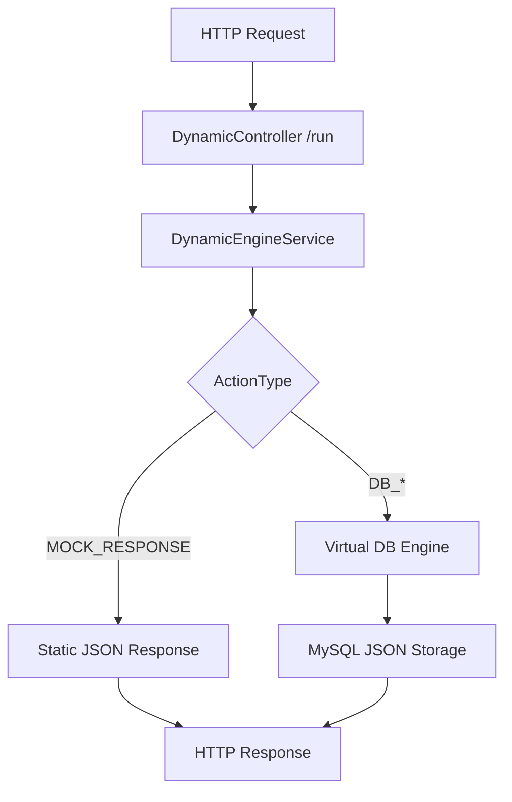

<p align="right">
  <a href="./README.es.md">🇪🇸 Español</a>
</p>

# 🚀 Dynamic Backend Engine (MVP)


> **Dynamic Backend Engine** is a SaaS backend engine and **No-Code API Builder** that allows you to define, deploy, and execute **dynamic RESTful APIs at runtime** — without writing code and without restarting the server.

---

## 🧠 Core Concept

> **The API lives in the database, not in the code.**

Users configure dynamic endpoints (path, method, and logic) directly in the database, and the engine interprets and executes them in real time.

Perfect for:
- Rapid prototyping
- No-Code / Low-Code platforms
- Multi-tenant SaaS backends
- MVPs that evolve without redeployments

---

## 🧱 Tech Stack

- **Framework:** NestJS (TypeScript)
- **Database:** MySQL 8.0
- **ORM:** Sequelize + Sequelize-Typescript
- **Infrastructure:** Docker & Docker Compose
- **Architecture:** Modular and scalable

### Core Modules
- Projects
- Endpoints
- Dynamic Engine
- Virtual Database

---

## ✨ Core Features

### 🔁 Dynamic Runtime Engine (`/run`)

- A **single controller** handles all dynamic API requests.
- Resolves logic based on:
  - `projectId`
  - `dynamic path`
  - `HTTP Method`
- No server restart required.
- Easily extensible through new `ActionTypes`.

---

### ⚙️ Action System (Action Types)

Each endpoint executes an action defined in the database:

| Action Type     | Description |
|-----------------|-------------|
| `MOCK_RESPONSE` | Returns a static JSON response with configurable status code |
| `DB_INSERT`     | Inserts request payload into a virtual collection |
| `DB_SELECT`     | Retrieves data with dynamic query-based filters |
| `DB_UPDATE`     | Updates existing records by ID |
| `DB_DELETE`     | Deletes records by ID |

---

### 🗄️ Virtual Database (Virtual DB)

A **schema-less persistence layer on top of MySQL**, powered by JSON columns.

Main tables:
- `virtual_collections`
- `virtual_collection_items`

Key benefits:
- No migrations required
- Supports arbitrary JSON structures
- Ideal for dynamic and evolving data models

---

## 🔄 How It Works

### Execution Flow



### Step by Step

1. Client calls `/run/:projectId/:dynamic-path`
2. The engine resolves the endpoint definition from the database
3. Executes the configured `actionType`
4. Returns the response instantly

---

## 🧪 Endpoint Configuration Examples

### 🎭 MOCK_RESPONSE

```json
{
  "actionType": "MOCK_RESPONSE",
  "actionData": {
    "statusCode": 201,
    "body": {
      "hello": "world"
    }
  }
}
```

---

### ➕ DB_INSERT

```json
{
  "actionType": "DB_INSERT",
  "actionData": {
    "collection": "users"
  }
}
```

---

### 🔍 DB_SELECT (Dynamic Filters)

```json
{
  "actionType": "DB_SELECT",
  "actionData": {
    "collection": "users"
  }
}
```

Example request:

```
GET /run/123/users?role=admin&country=US
```

---

### ✏️ DB_UPDATE

```json
{
  "actionType": "DB_UPDATE",
  "actionData": {
    "collection": "users"
  }
}
```

```
PUT /run/123/users?id=uuid
```

---

### 🗑️ DB_DELETE

```json
{
  "actionType": "DB_DELETE",
  "actionData": {
    "collection": "users"
  }
}
```

---

## 🌐 API Structure

### 🔐 Configuration Layer (Admin)

Create dynamic endpoints:

```
POST /projects/:projectId/endpoints
```

Allows defining:
- Dynamic path
- HTTP method
- Action type
- Action configuration

---

### ⚡ Runtime Execution Layer

```
GET | POST | PUT | DELETE
/run/:projectId/:dynamic-path
```

---

## 🐳 Local Installation & Deployment

```bash
# 1. Clone repository
git clone <repo-url>

# 2. Configure environment variables
cp .env.example .env

# 3. Start infrastructure
docker-compose up --build
```

Server available at:

```
http://localhost:3000
```

---

## 🚧 Project Status

**Stage:** MVP (Minimum Viable Product)

### Pending Features
- 🔐 Authentication & Authorization Guards
- 🧾 Logging and Audit system
- ✅ Input validation
- 📊 Metrics and observability
- 🧩 New Action Types (HTTP_CALL, WEBHOOK, SCRIPT)

---

## 🛣️ Roadmap (Vision)

- True multi-tenancy
- Endpoint versioning
- Per-project rate limiting
- No-Code UI Dashboard
- Action Types marketplace

---

## 📄 License

MIT License © Dynamic Backend Engine
